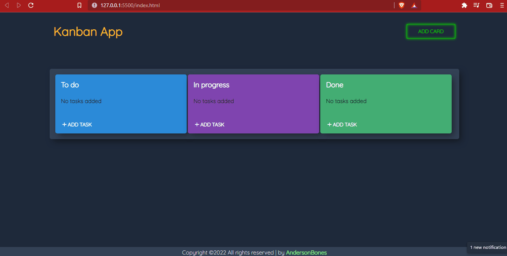

# 🟦 🟪 🟩 Kanban App 

Kanban trata-se de um sistema de controle e gestão de estoque e fluxo de peças que se utiliza de pequenos cartões coloridos — 
conhecidos como post-it — e também recebe o nome de gestão visual, em razão do uso de cores como sinalizadores.

## ● Funcionalidades ✅
- [x] Adiciona um novo card
- [x] Define o nome do card 
- [x] Define a cor do card
- [x] Remove o card
- [x] Adiciona uma tarefa no card
- [x] Define o nome da tarefa
- [x] Renomeia a tarefa
- [x] Move a tarefa para outro card
- [x] Move a tarefa uma posição acima de sua posição atual em seu card
- [x] Remove a tarefa

## ● ScreenShots 🖼️

● <a href='https://andersonbones.github.io/Kanban/'>DEMO 👽</a>
